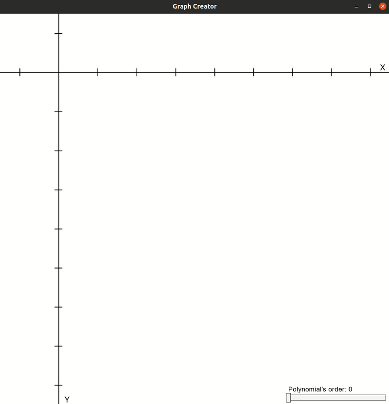

# Graph creator

I needed a way to plot empirical data in my programs. A nth order polynomial as an interpolating function works
for this purpose fine enough.

The idea is pretty simple and the maths itself is not even complicated. Take a look for yourself at https://en.wikipedia.org/wiki/Polynomial_interpolation.

As you can see in the GIF, I begin with some linear data points which can be approximated quite good with a linear. But after adding 
more points up to a parabola, you need a more powerful polynomial (which is the second polynomial as you may remember from high-school math). The idea 
applies for crazier shape. But if the polynomial is too higher, chance is the fitting will not be as good anymore.

### References
- [Polynomial interpolation](https://en.wikipedia.org/wiki/Polynomial_interpolation)